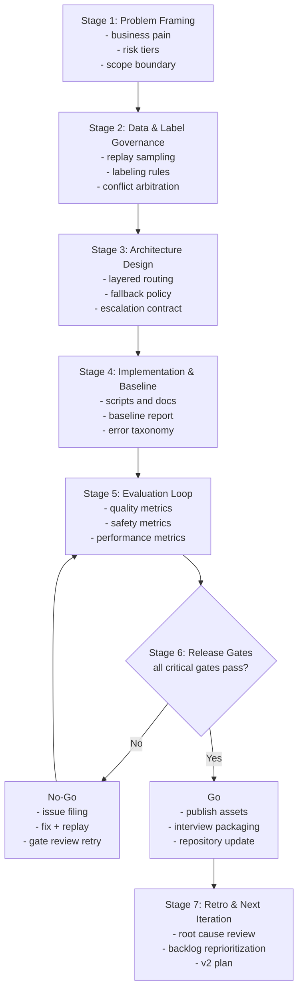

# End-to-End Delivery Flow

```mermaid
flowchart TD
    A["Stage 1: Problem Framing<br/>- business pain<br/>- risk tiers<br/>- scope boundary"] --> B["Stage 2: Data & Label Governance<br/>- replay sampling<br/>- labeling rules<br/>- conflict arbitration"]
    B --> C["Stage 3: Architecture Design<br/>- layered routing<br/>- fallback policy<br/>- escalation contract"]
    C --> D["Stage 4: Implementation & Baseline<br/>- scripts and docs<br/>- baseline report<br/>- error taxonomy"]
    D --> E["Stage 5: Evaluation Loop<br/>- quality metrics<br/>- safety metrics<br/>- performance metrics"]
    E --> F{"Stage 6: Release Gates<br/>all critical gates pass?"}
    F -- "No" --> G["No-Go<br/>- issue filing<br/>- fix + replay<br/>- gate review retry"]
    G --> E
    F -- "Yes" --> H["Go<br/>- publish assets<br/>- interview packaging<br/>- repository update"]
    H --> I["Stage 7: Retro & Next Iteration<br/>- root cause review<br/>- backlog reprioritization<br/>- v2 plan"]
```

