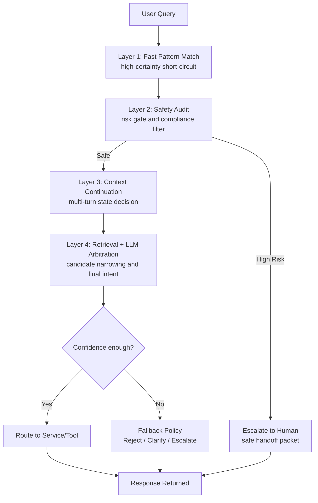

# Layered Routing Runtime Flow

```mermaid
flowchart TD
    U["User Query"] --> L1["Layer 1: Fast Pattern Match<br/>high-certainty short-circuit"]
    L1 --> L2["Layer 2: Safety Audit<br/>risk gate and compliance filter"]
    L2 -->|High Risk| ESC["Escalate to Human<br/>safe handoff packet"]
    L2 -->|Safe| L3["Layer 3: Context Continuation<br/>multi-turn state decision"]
    L3 --> L4["Layer 4: Retrieval + LLM Arbitration<br/>candidate narrowing and final intent"]
    L4 --> DEC{"Confidence enough?"}
    DEC -- "Yes" --> ROUTE["Route to Service/Tool"]
    DEC -- "No" --> FB["Fallback Policy<br/>Reject / Clarify / Escalate"]
    ROUTE --> RESP["Response Returned"]
    FB --> RESP
    ESC --> RESP
```

