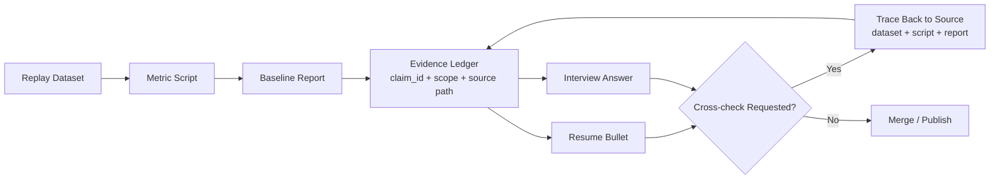

# Evidence Traceability Flow

```mermaid
flowchart LR
    D["Replay Dataset"] --> S["Metric Script"]
    S --> R["Baseline Report"]
    R --> L["Evidence Ledger<br/>claim_id + scope + source path"]
    L --> B["Resume Bullet"]
    L --> Q["Interview Answer"]
    B --> C{"Cross-check Requested?"}
    Q --> C
    C -- "Yes" --> T["Trace Back to Source<br/>dataset + script + report"]
    T --> L
    C -- "No" --> M["Merge / Publish"]
```

