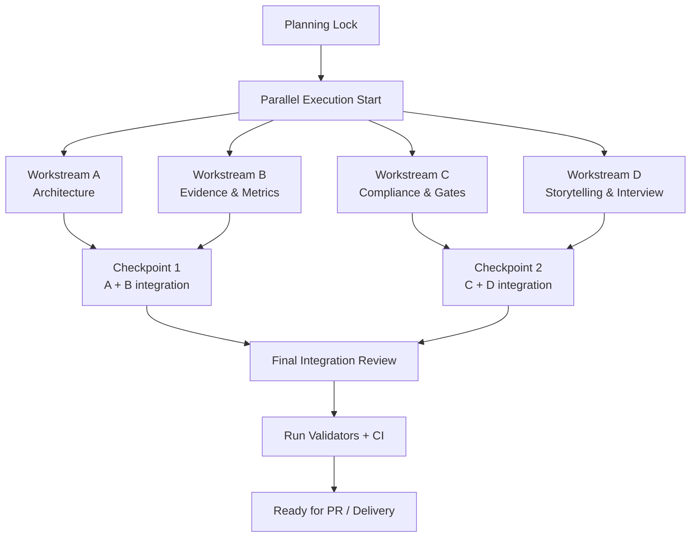

# Workstream Execution Flow

```mermaid
flowchart TB
    START["Planning Lock"] --> SPLIT["Parallel Execution Start"]

    SPLIT --> A["Workstream A<br/>Architecture"]
    SPLIT --> B["Workstream B<br/>Evidence & Metrics"]
    SPLIT --> C["Workstream C<br/>Compliance & Gates"]
    SPLIT --> D["Workstream D<br/>Storytelling & Interview"]

    A --> CP1["Checkpoint 1<br/>A + B integration"]
    B --> CP1
    C --> CP2["Checkpoint 2<br/>C + D integration"]
    D --> CP2

    CP1 --> FINAL["Final Integration Review"]
    CP2 --> FINAL
    FINAL --> VALID["Run Validators + CI"]
    VALID --> DONE["Ready for PR / Delivery"]
```

