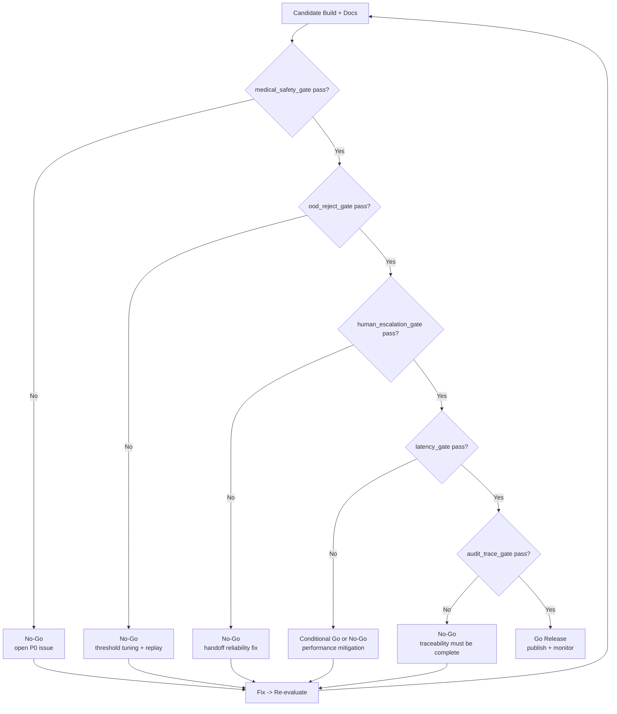

# Release Gate Decision Flow

```mermaid
flowchart TD
    IN["Candidate Build + Docs"] --> G1{"medical_safety_gate pass?"}
    G1 -- "No" --> NOGO1["No-Go<br/>open P0 issue"]
    G1 -- "Yes" --> G2{"ood_reject_gate pass?"}
    G2 -- "No" --> NOGO2["No-Go<br/>threshold tuning + replay"]
    G2 -- "Yes" --> G3{"human_escalation_gate pass?"}
    G3 -- "No" --> NOGO3["No-Go<br/>handoff reliability fix"]
    G3 -- "Yes" --> G4{"latency_gate pass?"}
    G4 -- "No" --> NOGO4["Conditional Go or No-Go<br/>performance mitigation"]
    G4 -- "Yes" --> G5{"audit_trace_gate pass?"}
    G5 -- "No" --> NOGO5["No-Go<br/>traceability must be complete"]
    G5 -- "Yes" --> GO["Go Release<br/>publish + monitor"]

    NOGO1 --> LOOP["Fix -> Re-evaluate"]
    NOGO2 --> LOOP
    NOGO3 --> LOOP
    NOGO4 --> LOOP
    NOGO5 --> LOOP
    LOOP --> IN
```

